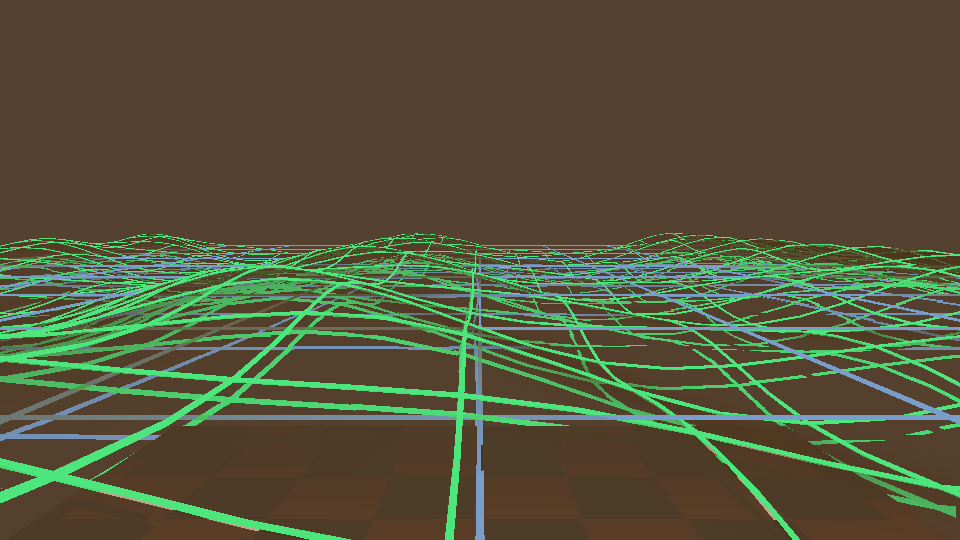

# FluidMatter Water

**Technical Art / Real-time Graphics** · Unity URP water rendering research prototype

**Current status:** **W3.0 Boundary Field = PASS / evidence-backed** · **W3.1 Shoreline & Foam = WIP**

## HERO water scene

**NEEDS_CAPTURE.** A readable real water-scene cover has not yet been captured from the current build. This page intentionally does not promote a Gerstner debug mesh or diagnostic tint as the project hero image.

**RUN DEMO: NEEDS_CAPTURE.** No short actual-run water demonstration is currently published.

## What It Is

FluidMatter is a real-time water rendering R&D system focused on keeping wave geometry, scene depth, optics, boundary data, authoring profiles and validation under explicit contracts instead of letting each effect reinterpret the same data independently.

The current target is quiet, clear shallow-pool / tide-pool water rather than an ocean simulator.

## Current Build

Evidence-backed in the accepted development state:

- Linear Eye Depth and depth validity handling.
- Screen-space refraction.
- Beer–Lambert transmittance / thickness-driven absorption.
- Reflection preview.
- Gerstner wave displacement.
- Shared `SurfaceData` for downstream water shading.
- Depth-derived `Boundary` field with `thicknessEye`, `proximity` and `valid` semantics.
- Profile / binding pipeline with shared-material-cache and MPB paths.
- Debug views and automated validation for the accepted W3.0 boundary contract.

**Not accepted yet:** shoreline appearance consumer and shoreline foam consumer. W3.1 remains WIP until its own acceptance markers and regression evidence exist.

## Rendering Pipeline

~~~mermaid
flowchart TD
    Profile[Authored Water Profile] --> Binding[Binding / Shared Material Cache / MPB]
    Binding --> Wave[Gerstner displacement]
    Wave --> Surface[SurfaceData]
    Surface --> Depth[Linear Eye Depth + validity]
    Depth --> Optics[Refraction + transmittance + reflection preview]
    Depth --> Boundary[Boundary field]
    Optics --> Composite[Final water composite]
    Boundary --> Debug[Boundary / diagnostic views]
~~~

W3.1 is intentionally not drawn as a completed stage in this pipeline.

## Surface / Waves

Gerstner displacement is the accepted surface-motion model in the current build. It supplies the displaced water surface used by later shading and boundary evaluation.

The existing wave capture is retained as **technical evidence**, not as a finished water-scene cover.

## Depth & Optics

The project uses one positive Linear Eye Depth convention. Valid scene depth feeds thickness evaluation; optics then use that data for screen-space refraction and Beer–Lambert-style transmittance. Reflection is currently a preview path, not SSR or planar reflection.

Screen-space refraction is limited to information visible in the current scene colour/depth buffers.

## Boundary / Shoreline

### Boundary — implemented / accepted

W3.0 provides an explicit boundary field with:

- `thicknessEye`
- `proximity`
- `valid`

Boundary answers **where** a valid water-contact region exists. It does not define foam.

### Shoreline / Foam — WIP

W3.1 is the next active milestone. The intended consumers may read accepted Boundary / SurfaceData, but the public project does **not** claim completed shoreline appearance or foam until W3.1 validation passes.

Current public status:

- Shoreline appearance: **WIP / not accepted**
- Shoreline foam: **WIP / not accepted**
- Open-water crest foam / wakes / interaction foam: **not implemented**
- Underwater rendering: **not implemented**

## Debug & Validation

W3.0 has recorded boundary/reference/capture/regression evidence. The accepted development record reports the W3.0 acceptance and automation markers, green authoritative CSVs, and a 15-gate historical regression with `isolation_unresolved = 0`.

Public showcase media intentionally keeps only a small audited subset:

*Boundary diagnostic preview. This is a diagnostic tint, not a finished shoreline effect.*

*Boundary debug encoding used by the W3.0 validation rig.*

*Gerstner wave-mesh validation. Technical evidence only; not the project cover.*

More detail: [technical overview](docs/technical-overview.md) · [status and limitations](docs/status.md) · [media attribution](docs/media-attribution.md)

## Current WIP

**W3.1 — Shoreline & Foam Visual Consumer**

The W3.1 task is to consume the accepted W3.0 Boundary field without redefining it, add a restrained shoreline appearance / shoreline-foam layer, and prove disabled identity, boundary ownership, camera stability, Gerstner coupling, binding parity, temporal stability and full regression.

No W3.1 PASS claim is made from task files, planned shaders, precheck material or roadmap text alone.

## Roadmap

1. Finish and validate W3.1 Shoreline & Foam.
2. Capture one readable real water-scene HERO image from the accepted build.
3. Capture one short actual-run water / wave / debug demonstration.
4. Only after W3.1 passes, consider W4.0 Caustics Foundation as the next milestone.

Roadmap items are not implemented features.

## Limitations

- Research prototype / WIP, not a production-ready water package.
- Validation context: Tuanjie 2022.3.62t16 · URP 14.2.0-t1 · Direct3D11.
- Existing reflection path is a preview; **SSR and planar reflection are not implemented**.
- **Underwater, caustics, FFT ocean, buoyancy and interaction systems are not implemented** in the accepted build.
- Existing headless/capture timings are not published as GPU per-pass benchmarks.
- Source/project distribution is not currently provided; this repository contains selected documentation and audited real captures rather than the full Unity project.
- No open-source license is currently declared for the project distribution.

[Lilith — Portfolio](https://github.com/lilith-techart)
