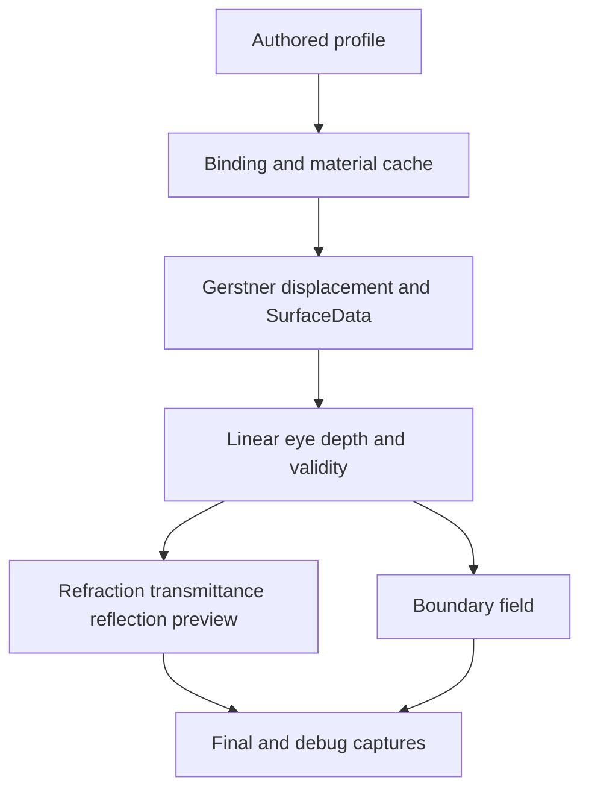

# FluidMatter Water

**Technical Art / Real-time Graphics** · Unity URP water rendering research prototype

**Research Prototype / WIP** · **W3.0 = evidence-backed；W3.1 = WIP**

## 要解决的问题

如何让波面、深度、光学与边界共享一致数据，而不让每个效果各自解释坐标、厚度和参数？FluidMatter 用显式数据契约、Debug 通道和参考对照研究实时水渲染。

## Implemented

- Linear Eye Depth 与数据有效性；screen-space refraction。
- Beer–Lambert transmittance；reflection preview。
- Gerstner wave displacement 与 SurfaceData。
- Depth-derived boundary field；Profile / binding / shared-material cache。

上图是已有波面网格验证画面，**不是完成水景封面**。展示封面和短动态演示：**NEEDS_CAPTURE**。

## Results / Evidence

W3.0 有边界场、validity、参考对照和回归记录。精选 [boundary Debug 与技术拆解](docs/technical-overview.md) 解释“测到了什么”，不把 diagnostic preview 当作完成的岸边泡沫。

## Architecture / Pipeline

## WIP / Roadmap

**W3.1 = WIP**：shoreline / foam consumer 仍在研发，未完成验收。Roadmap 是补清晰的真实水景、波面与 Debug 动态，并验证 consumer 对既有数据契约的使用。

本入口不宣称已经完成 shoreline foam、underwater system、FFT ocean、SSR、planar reflection 或 GPU benchmark。

研究连接：将波面几何、厚度与边界场的表达变成可解释的渲染实验与对照方法；未宣称已完成观众研究或性能结论。

## Current Status / Distribution

[阶段状态与限制](docs/status.md) · [媒体来源与归属](docs/media-attribution.md)

Recorded validation context: Tuanjie 2022.3.62t16 / URP 14.2.0-t1 / Direct3D11；不外推其他 API，也不把 headless capture 时间当成 GPU per-pass benchmark。

Source/project distribution is not currently provided. 本仓库只提供精选技术文档与真实捕获，不包含完整 Unity 项目、源码包或可运行下载；本次没有指定开源许可证。

[Lilith — Portfolio](https://github.com/lilith-techart)
