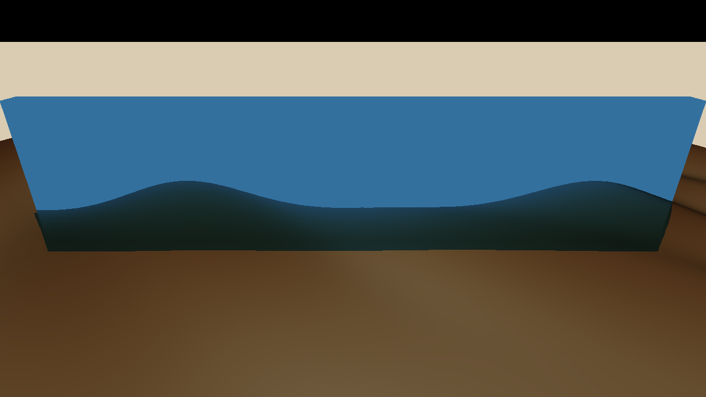
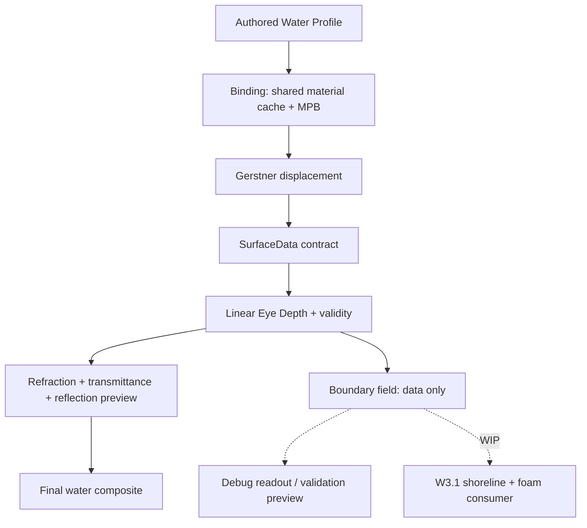
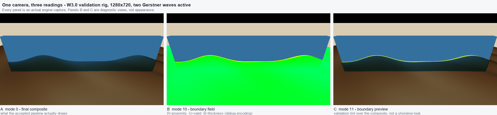

# FluidMatter Water

**Technical Art / Real-time Graphics** · A continuously developed real-time water rendering system, built as a data-contract problem rather than a shader effect.

**Status:** W3.0 Boundary Field = **accepted, evidence-backed** · W3.1 Shoreline & Foam = **in development** · Research prototype, not a product.

*Actual engine capture from the accepted W3.0 build (debug mode 0 = final composite, 1280×720, two Gerstner waves active). The dark band along the near edge is thickness-driven absorption; the silhouette is displaced Gerstner geometry. This is a **validation rig**, not an art pass — see [Visual status](#visual-status--what-is-still-missing).*

---

## Read this in 30 seconds

- **What it is:** a real-time water rendering R&D system where wave geometry, scene depth, optics, shoreline boundary data, authoring profiles and validation all share explicit data contracts, instead of each effect reinterpreting the same numbers on its own.
- **What is proven:** a linear eye-depth convention, screen-space refraction, Beer–Lambert transmittance, a reflection *preview* path, Gerstner surface displacement, a shared `SurfaceData` contract, and a depth-derived `Boundary` field — all validated by an automated 15-gate regression harness with 3,343 graded measurement rows and 0 failures.
- **What is deliberately not claimed:** shoreline appearance, foam, underwater rendering, SSR, planar reflection, caustics, FFT ocean, or any GPU performance number. Each is listed under [Not implemented](#not-implemented--not-claimed).
- **What is in progress:** W3.1, which turns the accepted boundary *data* into a restrained shoreline look without redefining it.

---

## The research question

Most real-time water shading breaks in the same way: three systems each ask "how deep is the water here?" and get three different answers, so absorption, refraction and shoreline effects disagree at the exact pixels where the scene is most visible.

FluidMatter treats that as a data problem first. Each quantity gets one owner, one definition, one validity rule, and an explicit consumer contract. Visual quality then becomes a function of a system that can be tested, rather than a pile of tuned constants that happens to look right from one camera angle.

The current artistic target is deliberately narrow: **quiet, clear, shallow pool / tide-pool water**, not an ocean simulator. A narrow target is what makes the measurements below meaningful.

---

## Verified in the current build

Status vocabulary — **production**: consumed by the final composite · **preview**: implemented and validated, but explicitly not the final look · **debug**: diagnostic view only · **data**: exists as a contract, no appearance consumer yet · **WIP** / **planned**: not claimed.

| Module | Status | What backs the claim |
|---|---|---|
| Linear Eye Depth + validity | production | One positive depth convention with a sanitised validity flag; sky and foreground samples never contribute thickness |
| Thickness / `SurfaceData` | production | Shared surface contract (position, displacement, geometry normal, tangent/binormal, shaded normal) consumed downstream instead of re-derived |
| Screen-space refraction | production | Offset with clamp, viewport-edge fallback and explicit foreground rejection; limited to what the current colour/depth buffers contain |
| Beer–Lambert transmittance | production | Analytic-vs-sampled comparison, monotonic non-increasing transmittance per channel, hostile coefficients sanitised |
| Environment reflection | **preview** | Reflection vector + Schlick Fresnel + composition against a controlled probe. **Not SSR, not planar reflection** |
| Gerstner wave displacement | production | Up to 4 wave slots; CPU reference vs GPU agreement on the production normal path; multi-wave superposition bounded by Σ(A·max(1,S)) |
| Boundary field | **data** | `thicknessEye` / `proximity` / `valid`, derived from accepted depth, evaluated on the *displaced* surface. No production look consumes it yet |
| Profile / binding pipeline | production | Shared-material-cache and `MaterialPropertyBlock` paths proven pixel-identical; hostile payloads sanitised |
| Debug views + validation harness | production | 12 diagnostic modes with a frozen numbering contract; automated gates with archived failures |

---

## Rendering pipeline

The dashed edges are the point: at the accepted state the boundary reaches the composite through **no** production path, and the only real consumers are a debug readout and a validation preview. The W3.1 branch is where the in-progress work is going, not where it already is.

---

## One view, three readings

This is the clearest way to see what the boundary work actually contributes today.

*Three captures of the **same** camera and the same two active waves. **A** is what the build draws. **B** is the debug encoding of the boundary field (R = proximity, G = validity, B = normalised thickness). **C** is a validation tint overlaid on the composite. The field's green band follows the displaced wave silhouette, which is the behaviour W3.0 was gated on. B and C are diagnostic views — neither is a shoreline effect, and neither is offered as appearance.*

---

## Surface / waves

Gerstner displacement is the accepted surface-motion model: up to four authored slots, each with direction, amplitude, wavelength, speed and steepness, with non-finite and degenerate parameters rejected at evaluation rather than propagated. Horizontal displacement is `S·A`, so the model documents its own crest-folding limit instead of hiding it.

What the surface publishes to everything downstream is a single `SurfaceData` contract: rendered world position, the displacement itself (so the material point is recoverable), the analytic geometry normal, the parametrisation partials, and the shaded normal actually handed to lighting. Geometry normal and shaded normal are kept distinct on purpose — collapsing them was the class of bug this contract exists to prevent.

*Technical evidence from the multi-wave superposition gate, retained as engineering proof. The green/blue polylines are the validation rig's analytic reference curves; this frame is **not** the project's visual target, which is why it is not used as the cover.*

---

## Depth & optics

One positive linear eye-depth convention feeds everything. Thickness is valid scene depth minus surface depth, clamped non-negative, measured **along the view axis** — which is stated rather than glossed over, because it is not the shortest Euclidean distance to shore, and a shoreline look eventually has to care about the difference.

Refraction is screen-space and therefore bounded by what the current buffers contain: it cannot recover occluded detail, and it explicitly refuses to sample foreground geometry dragged below the water line. Transmittance follows Beer–Lambert with per-channel coefficients, monotonic in thickness. Reflection is a Fresnel-weighted preview against a controlled probe, and is labelled preview everywhere it appears.

---

## Boundary / shoreline

### Boundary — accepted as data

The W3.0 field carries three values with distinct jobs: `thicknessEye` (view-axis water thickness), `proximity` (1 at contact, 0 at or beyond the authoring distance, affine in between), and `valid` (whether the depth sample can be trusted — explicitly *not* a feature-enable flag).

Invariants that were gated rather than assumed: invalid depth contributes no proximity; occluded footprint pixels are never painted through; the field follows the displaced surface instead of the flat plane; the shared-material and MPB binding paths agree pixel-for-pixel; and a 600-frame temporal run stays finite with no unexplained frame-to-frame jumps.

Accepted profiles ship the feature **off** (`_boundaryEnabled: 0`). That is intentional: W3.0 delivers a trustworthy field, not a look.

### Shoreline / foam — in development

W3.1 is the active milestone: consume the accepted field without redefining it, add a restrained shoreline and foam layer, and prove disabled-identity, boundary ownership, camera stability, wave coupling, binding parity, temporal stability and full regression. Precheck studies (shoreline shaping curve choice, foam noise coverage and detail budget) exist, and binding code is in flight — **neither is a W3.1 pass claim**, and no W3.1 result is presented as accepted.

---

## How it is validated

Not by looking at it and nodding. Each milestone runs an automated in-editor harness that compares GPU output against a CPU reference implementation of the same maths, and writes graded CSV rows with explicit expectations and tolerances.

For the accepted W3.0 state: **15 gates across two independent passes, all PASS**, 3,343 graded measurement rows with **0 FAIL**, `isolation_unresolved = 0`, and gate coverage across geometry bands, wave coupling, occlusion, invalid depth, profile sanitisation, binding parity, temporal stability, precision, view angle, preview and performance shape.

Representative measured numbers, with their scope attached:

- Smallest stable boundary distance `0.001 m`, with a half-float storage floor of `0.00024 m` **at that particular ruler** — a storage floor, not a resolution claim.
- Shared-cache vs MPB parity: `469,236` pixels compared, max channel difference `0`, disagreeing pixels `0`.
- Occlusion: `227,624` occluded footprint pixels measured, `0` of them painted through.
- View angle: band width varies up to **4.98×** across a 30° ramp — a measured limitation, published instead of smoothed over.
- Nine archived failing runs are preserved with their FAIL rows, so the record still shows fail → diagnose → fix → pass.

---

## Known limitations

Stated as gaps, not as settled conclusions.

1. **Opaque scenery only.** The boundary describes the depth the water was given. Transparent objects never reach `_CameraDepthTexture`, so the field reports no contact against them — correctly, but silently.
2. **Water cannot touch water.** One depth sample, one surface: wake edges and waterfall feet produce no proximity. Classified as not required rather than left as an oversight.
3. **Bounded by the water silhouette.** Where no water fragment is shaded, no boundary exists; an occluded shoreline reads as "no data", not "far".
4. **No GPU price exists.** The headless capture path costs as much as or more than the frame it captures, so no enabled/disabled delta was resolvable above noise. "Not measured" must not be read as "free".
5. **Narrow view-angle and precision scope.** Conclusions hold for the measured ramp, resolution and arc distance, and the precision floor cannot be transferred to another resolution without re-measuring.
6. **No appearance consumer yet.** The boundary is data; the accepted profiles author it off, and the two visual readings of it in this repository are diagnostic views.
7. **Validation rigs, not art.** Every image here comes from a controlled test scene with known geometry, chosen so measurements mean something.

---

## Not implemented / not claimed

Shoreline appearance · shoreline foam · open-water crest foam · wakes · interaction foam · underwater rendering · caustics · FFT/infinite ocean · SSR · planar reflection · buoyancy/physics · flow maps · GPU benchmarks · cross-API certification.

A term appearing in a roadmap, a precheck document, or an in-progress source file is not evidence that it ships.

---

## Visual status — what is still missing

**HERO art pass: NEEDS_CAPTURE.** The repository intentionally has no beauty cover. The captures above are honest engine output from validation rigs; promoting one as the project's visual result would misrepresent a W3.0 data milestone as finished art.

**Motion demo: NEEDS_CAPTURE.** No short actual-run clip is published yet.

No generated or AI-produced imagery is used anywhere in this repository, and none is used to fill these two gaps.

---

## Roadmap

1. Complete and validate W3.1 shoreline / foam consumers against the accepted boundary contract.
2. Capture one readable water-scene cover and one short actual-run demonstration from the accepted build.
3. Design a real player/GPU measurement if performance conclusions are ever wanted.
4. Only after W3.1 passes: consider W4.0 caustics foundations.

---

## Environment

Tuanjie 1.10.4 (Unity-compatible 2022.3.62t16) · URP 14.2.0-t1 · Direct3D 11 · HLSL / ShaderLab · C# editor automation · perspective validation rigs.

## Repo scope & rights

This repository is a **showcase**: selected documentation and rendered evidence only. Full project source, scenes, shaders and engine/package content are not distributed here, and public visibility is not an open-source licence. Third-party engine and pipeline names belong to their respective rights holders. See [media attribution](docs/media-attribution.md) for per-image provenance.

**More detail:** [technical overview](docs/technical-overview.md) · [validation & evidence](docs/validation-and-evidence.md) · [status & limitations](docs/status.md) · [media attribution](docs/media-attribution.md)
