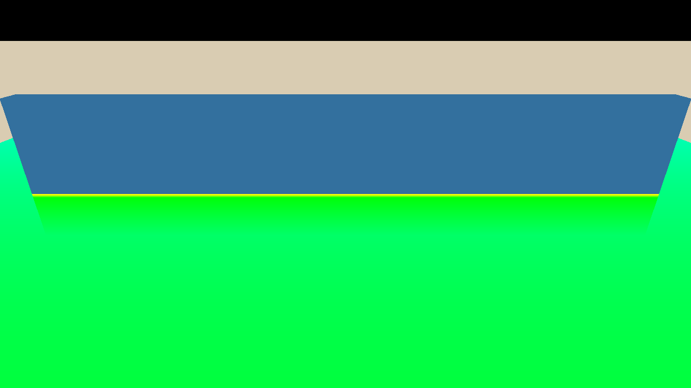
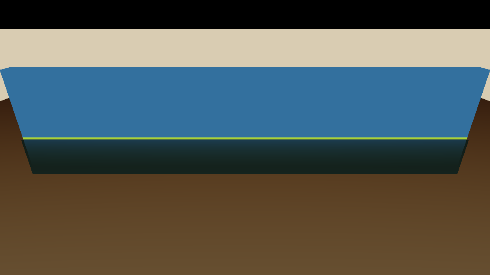

# FluidMatter — 技术拆解

## Depth 与 SurfaceData

同一正 Linear Eye Depth 约定下，水体厚度为有效场景深度减去 surface depth，再限制为非负。该量沿视轴，不等于最短欧氏岸边距离。SurfaceData 将波面位置、位移和几何/着色信息传给 downstream modules。

Gerstner 位移提供波面几何；refraction、transmittance 和 reflection preview 在各自明确输入下组合。screen-space refraction 只能采样当前可见的 scene colour/depth。

## W3.0 boundary field

boundary field 包含 proximity、validity 与 thickness。无效深度必须不给 proximity 贡献，避免天空或前景成为伪接触边界。

R = proximity；G = validity；B = normalized thickness。该测试 rig 的相机、墙与水面构成已知对照，不是实际海岸场景。

这是与最终 composite 结合的 diagnostic tint。它展示 field 的覆盖关系，**不代表 shoreline foam 已实现**。

## 验证方法与边界

既有 W3.0 记录包括 CPU/reference 对照、capture 精度、视角、temporal、binding、preview 与 regression cases；失败过程保留在私有研发记录。公开展示只描述方法和范围，不搬运原始内部报告或日志。

headless timing 包含 render submission、同步与 capture 开销，不能作为 GPU per-pass cost。Reflection preview 不等于 SSR 或 planar reflection；本项目不据此提供 FPS 或 GPU benchmark。
